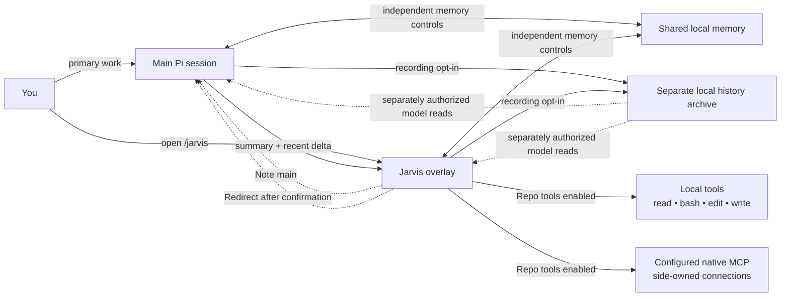
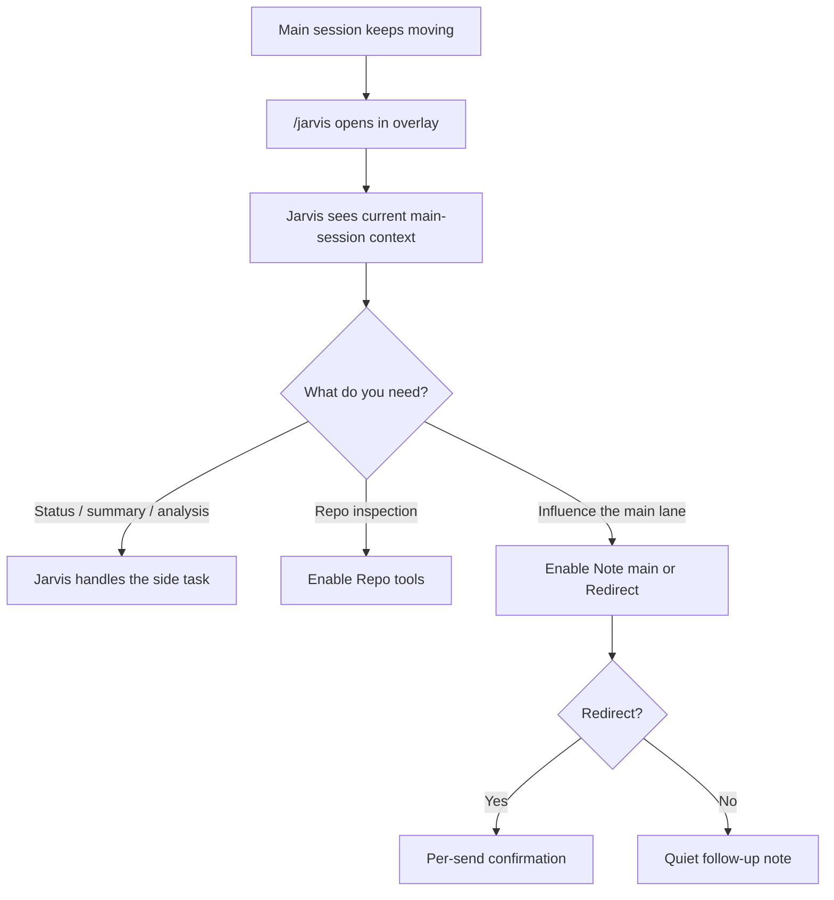
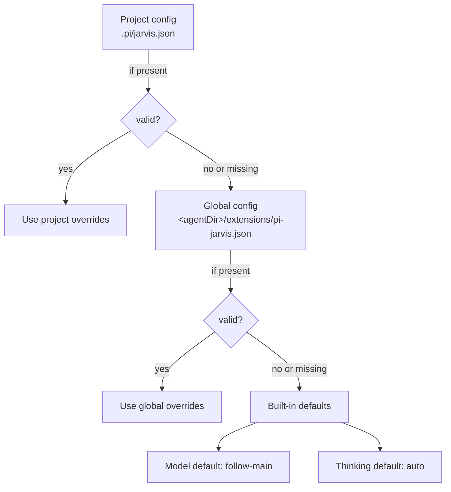
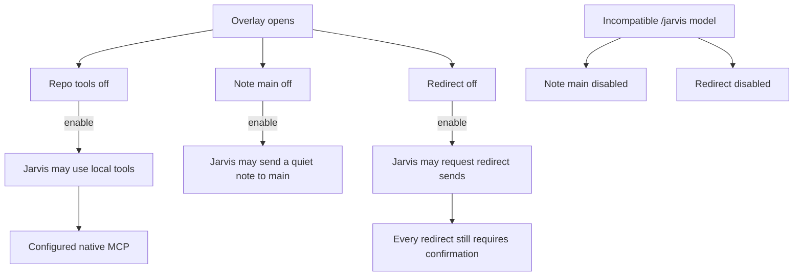
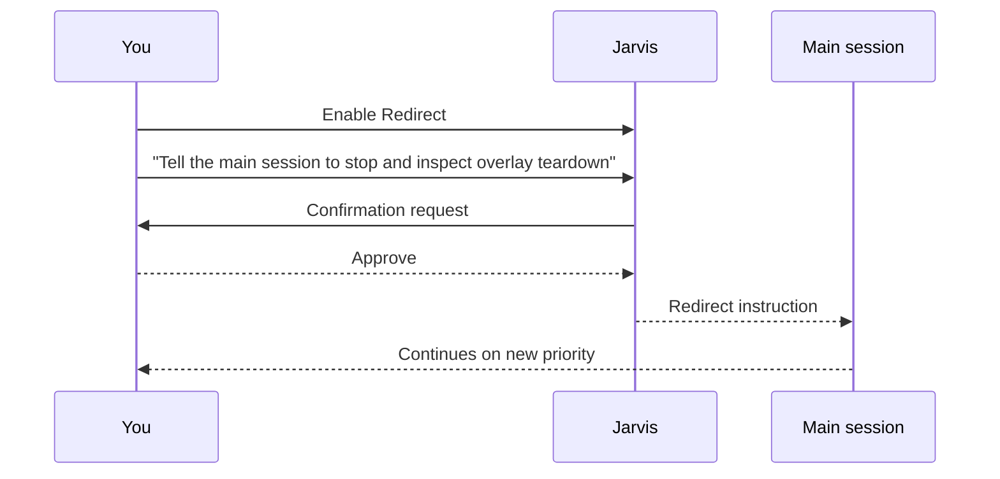

# pi-jarvis

<div align="center">


## A cinematic side-conversation overlay for Pi

**A second lane of thought—with shared memory and an optional searchable history archive.**

`pi-jarvis` adds `/jarvis`: a polished overlay where you can ask for status, inspect the repo when you explicitly allow it, and send a quiet note or a confirmed redirect back to the main lane.

**Remember what matters. Find the original history when you need it.** Main Pi and Jarvis share [persistent memory](#shared-memory); the separate, opt-in [full-session archive](#full-session-archive) adds indexed history search across sessions and, when explicitly requested, projects. **New in 1.9.0: bulk-import existing Pi sessions with a preview and explicit confirmation.**

[](https://github.com/crustyhacker/pi-jarvis/actions/workflows/ci.yml)
[](https://www.npmjs.com/package/pi-jarvis)
[](./LICENSE)
[](https://github.com/crustyhacker/pi-jarvis)
[](./package.json)

<p><strong>Current version:</strong> 1.9.0</p>

<p>
  <strong>Shared persistent memory</strong> ·
  <strong>Optional indexed session archive</strong> ·
  <strong>Confirmed bulk history import</strong> ·
  <strong>Persistent side session</strong> ·
  <strong>Live main-session awareness</strong> ·
  <strong>Opt-in local tools + native MCP</strong> ·
  <strong>Safe redirect flow</strong>
</p>

</div>

<details>
<summary>Plain-text wordmark</summary>

```text
     _    _    ____ __     _____ ____
    | |  / \  |  _ \\ \   / /_ _/ ___|
 _  | | / _ \ | |_) |\ \ / / | |\___ \
| |_| |/ ___ \|  _ <  \ V /  | | ___) |
 \___//_/   \_\_| \_\  \_/  |___|____/

       PI / A SECOND LANE OF THOUGHT
```

</details>


*Renderer preview with a custom dark palette and demo conversation—not a live provider session. Your Pi theme controls the normal overlay.*

---

## The pitch

The main Pi session should stay on the critical path.

`/jarvis` gives you a **second cockpit** for the work that should not interrupt that primary flow:

- checking what the main agent is doing right now
- seeing what changed since the last `/jarvis` turn
- asking for triage, summaries, or a second opinion
- inspecting the repo with local tools when you turn them on
- sending a non-interrupting note back to the main session
- redirecting the main session only after explicit confirmation

> Think of it as a side conversation with real context, not a detached scratchpad.

### Typical prompts

- *"What is the main agent doing right now?"*
- *"Summarize the last validation failure and tell me what matters."*
- *"Check this file while the main session keeps moving."*
- *"Compare what changed since my last `/jarvis` turn."*
- *"Redirect the main session, but make me confirm it first."*

---

## Two complementary memory features

| | Shared memory | Optional full-session archive |
|---|---|---|
| **Purpose** | Remember useful preferences, corrections, decisions and references | Find original recorded conversations, tool activity and session history |
| **What it keeps** | Curated notes plus bounded finalized user/assistant text captures | Complete accepted finalized Pi journal entries, with provenance and paged raw reads |
| **Default** | **On in trusted projects**, with separate capture/recall controls | **Off**; recording and model access are separately controlled |
| **Retrieval** | Automatic recall from global/current-project memory; explicit broader search | Local indexed search and session browsing; no automatic context injection |
| **Manage it** | `/jarvis-memory` · overlay `/memory` | `/jarvis-archive` · overlay `/archive` |

Both work across main Pi and Jarvis, independently of **Repo tools** and whether the overlay is open. Each has its own local SQLite store and global/project controls. Turning one off does not turn the other off.

**Privacy matters:** storage is local plaintext. Archive content is unredacted and can include secrets; granting model access can send retrieved content to your model provider. “Full” means accepted finalized data exposed by Pi—not hidden provider reasoning or a crash-safe audit log. Historical import is explicit. See the [memory controls](#shared-memory) and [archive limits](#full-session-archive) before enabling more access.

---

## At a glance

| Capability | What you get |
|---|---|
| **Shared memory** | Main Pi and Jarvis remember useful discussions across sessions; enabled by default, with global/project controls and a master off switch |
| **Optional full-session archive** | Off by default; raw finalized entries, local indexed cross-session search, separate model permission, and preview-confirmed bulk history import |
| **Persistent side lane** | `/jarvis` keeps its own isolated conversation state and restores prior side-session history |
| **Live awareness** | Jarvis sees the current main-session summary plus a delta since the last `/jarvis` turn |
| **Permission-gated tools** | Local `read`, `bash`, `edit`, `write`, and configured native MCP stay off until you enable Repo tools |
| **Safe main-session handoff** | `Note main` is quiet; `Redirect` is confirmation-gated |
| **Independent model control** | Follow the main model or pin `/jarvis` to a separate model |
| **Cleaner UX** | A one-time neon ASCII intro, then compact diagnostics, scrollback, multiline drafts, and independent activity/queue feedback |

---

## How it fits into Pi



### Operating model



---

## Why use `/jarvis` instead of the main lane?

Use `/jarvis` when you want:

- a second opinion without changing the primary plan yet
- a quick repo inspection while the main agent keeps moving
- a compact explanation of current progress or validation state
- a controlled way to send guidance back to the main session

Stay in the main lane when you want:

- the main plan to change immediately
- the main session itself to execute the next step directly
- no side conversation overhead at all

---

## Quick start

### 1) Install

```bash
pi install npm:pi-jarvis
```

This package is meant to run **inside a Pi installation** that already provides the Pi runtime packages. Those host packages are declared as optional peers so npm does not install a second copy of the full Pi/AI provider stack just to add this extension.

Requires **Pi 1.0.0** and **Node.js 22.19.0 or newer**. Version **1.6.0** supports local repository tools and opt-in native Pi MCP as described below; it does not load the legacy `pi-mcp-adapter` or bundle another Pi runtime.

### 2) Restart or reload Pi

`pi install` registers the package automatically. For local development, build and load `./dist/index.js` with `pi -e ./dist/index.js`.
**New in 1.7.0: shared memory is enabled by default in trusted projects**, including main Pi even if you never open the overlay. A first-use notice explains capture and recall. Already using another memory extension? Run `/jarvis-memory off` before your first prompt; this disables both main and Jarvis memory without deleting anything.

**New in 1.8.0: the separate full-session archive is OFF by default.** Nothing is imported or recorded by that subsystem until you opt in. See [Full-session archive](#full-session-archive).

### 3) Open Jarvis

```bash
/jarvis
```

Or open it and send the first message immediately:

```bash
/jarvis summarize the last validation failure and suggest the fastest next move
```

### 4) Turn on more power only when you want it

- leave `Repo tools` off for context / analysis without repository or MCP access; shared memory has separate controls
- turn `Repo tools` on when you want local `read`, `bash`, `edit`, `write`, and configured native MCP capabilities
- turn `Note main` on when you want Jarvis to quietly message the main session
- turn `Redirect` on when you want Jarvis to propose a redirect that you still explicitly confirm

---

## Command surface

### `/jarvis`
Opens the side overlay. If text follows the command, that text becomes the first side-session prompt.

### `/jarvis-model`
In Pi's terminal UI, running `/jarvis-model` with no argument opens a searchable model picker. In RPC, JSON, and print modes it reports the current selection; exact model-setting commands still work. `/jarvis` itself requires the terminal UI and does not start hidden work in other modes.

### `/jarvis-model [--project|--global] <provider/model>`
Pins `/jarvis` to a specific model without changing the main session model. A plain `/jarvis-model <provider/model>` writes a **project-local** override to `.pi/jarvis.json`.

### `/jarvis-model [--project|--global] follow-main`
Restores the chosen scope to `follow-main`. A project-scoped `follow-main` override still wins over a global pinned setting.

### `/jarvis-model [--project|--global] clear`
Removes the selected scope so `/jarvis` falls back through the remaining config layers to the built-in default.

### `/jarvis-thinking [--project|--global] auto|follow-main|off|minimal|low|medium|high|xhigh|max`
Sets the thinking level used by `/jarvis` without changing the main session thinking level. A plain `/jarvis-thinking <level>` writes a **project-local** override to `.pi/jarvis.json`.

- `auto` preserves the built-in behavior: follow the main thinking level only when `/jarvis` follows the main model; pinned `/jarvis` models use `off`.
- `follow-main` follows the main thinking level even when `/jarvis` is pinned to a separate model.
- Explicit levels request that thinking level; Pi clamps it to the selected model's supported levels.
- Changes to main thinking immediately synchronize when `/jarvis` follows it.
- xAI `/jarvis` models still force thinking `off`.

### `/jarvis-thinking [--project|--global] clear`
Removes the selected scope so `/jarvis` thinking falls back through the remaining config layers to the built-in `auto` default.

### `/jarvis-memory`
Reports shared-memory status. Use `/jarvis-memory help` for controls and data-management commands. Memory controls default to **global**, unlike model/thinking controls. See [Shared memory](#shared-memory) below.

### `/jarvis-archive`
Reports the separate full-session archive's status. It defaults **OFF**, with independent capture and model-access controls. `/jarvis-archive help` documents enablement warnings, paging, explicit import, and deletion. See [Full-session archive](#full-session-archive).

### Side-session commands inside `/jarvis`
The `/jarvis` input handles a small set of built-in commands against the isolated side-session:

- `/compact [instructions]` compacts the `/jarvis` conversation context.
- `/tree` prints the `/jarvis` session tree with entry IDs.
- `/tree <entry-id>` navigates the `/jarvis` session tree to that entry.
- `/tree --summarize <entry-id> [instructions]` navigates and summarizes the branch being left.
- `/new` starts a fresh `/jarvis` side-session without changing the main Pi session.
- `/memory …` or `/jarvis-memory …` manages shared memory immediately, without sending a model prompt or waiting for queued side work. Initial forms such as `/jarvis /memory off` are also handled locally, without booting a side session.
- `/archive …` or `/jarvis-archive …` manages the separate optional archive locally, without model/queue work; initial `/jarvis /archive …` works without booting a side session.

---

## Full-session archive

This is a **separate, optional subsystem**, not a change to shared memory's curated notes or bounded text captures. It is **OFF by default**, independent of Repo tools, Note main, Redirect, and overlay open/close. Model reads are **also off by default**, even after recording is enabled. No archive content is automatically injected into prompts.

### Enable only after reviewing the risks

```text
/jarvis-archive                                    # status; no archive-record reads
/jarvis-archive --project on --confirm-sensitive    # record here only
/jarvis-archive on --confirm-sensitive              # enable globally
/jarvis-archive model-access on --confirm-sensitive # allow model search/read; recording alone doesn't
/jarvis-archive capture off                         # pause recording default, retain access
/jarvis-archive off                                 # global MASTER OFF; keep stored data
/jarvis-archive clear --confirm-sensitive           # remove global settings; fallback may re-enable
```

Controls default to **global**; use `--project` for an override. Resolution is per-field project > global > defaults (`enabled: false`, `capture: true`, `modelAccess: false`), except an **explicit global off overrides every project**. `capture off` and `model-access off` set defaults that a project can override; inspect effective status. Use `clear --confirm-sensitive` to remove a scoped setting, never data. Malformed/unreadable settings and untrusted projects pause **all** archive access. Full off blocks even manual record inspection; recording-only/model-only pauses do not prevent explicit human reads. Separate files avoid interfering with memory/model settings:

- Global: `<active-agent-dir>/extensions/pi-jarvis-archive.json`
- Project: `.pi/jarvis-archive.json`
- Shape: `{ "archive": { "enabled": true, "capture": true, "modelAccess": false } }`

Enabling/model-access commands require the literal warning acknowledgment, and direct-file enablement shows a first-use warning. **This archive is unredacted plaintext and may retain passwords, tokens, private files, and sensitive tool output.** Model access can send retrieved data to the active provider. It is not a sandbox, encryption mechanism, or a substitute for carefully managing secrets.

### What “full” means

Accepted **new, finalized Pi journal entries** are retained as complete JSON, without memory's secret filtering, 16 KiB text cap, or 10,000-record eviction. This includes user/assistant/system messages, exposed thinking, tool calls/results and details, failed/aborted output that Pi retained, inline image payloads, custom entries, compaction/context edits, and branch metadata. Session headers retain provenance, including parent-session links. Search indexes textual content locally with SQLite FTS5; binary image data and opaque signatures are retained but not text-indexed. There is no OCR, embedding service, or background model call.

“Full” **does not mean an infallible wire/stream audit log**. Hidden provider reasoning, keystrokes, intermediate stream/tool updates, non-persisted commands/events, external attachment files, and output already truncated by Pi/tools are not recovered. Referenced files are **never automatically opened or copied**. Later message-redaction hooks run before capture. Raw history includes abandoned branches and superseded context, not just the effective current model context.

Recording begins after an activation baseline, never by importing pre-existing entries. Captures occur at finalized turn/settlement and supported session boundaries, not per token. The side owner takes a final snapshot of already-finalized entries before disposal, while recording remains authorized. Crashes, late shutdown hooks, unsupported journal APIs, failed storage, or permission transitions can leave gaps; warnings report observation/storage failures without replaying uncertain writes. Pending/disabled-period content is not backfilled after re-enable. Explicit **64 MiB raw-entry and indexing ceilings reject oversized work rather than truncating it**. Normalization uses bounded chunks; pathological Unicode combining/composition contexts beyond 64K UTF-16 units also reject explicitly. Conservative index budgeting can reject excessive whitespace/normalization expansion even if its final folded text would be smaller. No automatic eviction or strict total-disk quota is imposed: monitor space and prune deliberately. Large synchronous writes/indexing can pause the UI. Search/page order may change as other sessions append/delete records; pagination is not a frozen snapshot.

### Search and inspect

```text
/jarvis-archive search deployment decision
/jarvis-archive search --all --offset 20 deployment
/jarvis-archive session --all <session-id> 0
/jarvis-archive read --all <record-id> 0
/jarvis-archive read --all --metadata <record-id> 0
/jarvis-archive stats --all
```

Search/session pages return bounded excerpts of normalized indexing text with IDs, project, lane, timestamps and parent entry IDs. Excerpts are not exact quotations; use `read` for original case and content. Follow `nextOffset` to continue. Exceptionally large/escape-heavy provenance is explicitly labeled with `abbreviated` field names, never allowed to block record access; `read --metadata` (model tool `part: "metadata"`) pages the exact original metadata. `read` returns complete raw JSON **through pages**; its offsets count Unicode codepoints, not bytes or UTF-16 units. Results are bounded to 24,000 bytes of JSON plus an untrusted-data notice; stored payloads are not shortened. Use explicit `--all` to access other projects. Models get only three read-only tools—`jarvis_archive_search`, `jarvis_archive_read`, and `jarvis_archive_session`—when model access is enabled. No model controls, import, or deletion tools exist. Tools recheck current permissions/trust/cancellation and reject stale definitions.

Global accessibility is within the **same active Pi agent directory**, not cloud sync or other users' machines. Project controls govern operations initiated here; existing records from a paused project remain accessible through explicit all-project queries from another allowed project. Disabling is not deletion. Returned model-tool results persist normally in Pi and can be captured again as part of a later journal entry.

### Import all existing Pi sessions

With archive recording enabled, run:

```text
/jarvis-archive import-all
```

This **previews** `.jsonl` candidates recursively under the active Pi agent directory's `sessions` folder (normally `~/.pi/agent/sessions`). It shows the candidate file count before any transcript body is read or archived. Then paste the confirmation command supplied by the preview:

```text
/jarvis-archive import-all --confirm-sensitive --preview <preview-id>
```

For a different session directory, preview it explicitly:

```text
/jarvis-archive import-all /absolute/path/to/session-directory
```

The default covers Pi's standard main-session directory across projects. For older Jarvis side sessions, repeat the preview for `<active-agent-dir>/jarvis-sessions`; custom `--session-dir` locations also need an explicit directory preview.

The confirmation token selects the **exact reviewed file list**, not a fresh scan. Files created afterward are not silently added. Existing identical entries are skipped, and each source file keeps its original project/session identity. Bad/legacy files are reported individually rather than hiding failures or abandoning the rest of the batch. Original transcripts are never rewritten.

```text
/jarvis-archive import-report <report-id>       # paged per-file results
/jarvis-archive import-report <report-id> <nextOffset> # follow the returned offset
/jarvis-archive import-cancel                   # stop pending/active imports
```

Previews expire after 10 minutes and are bound to the current project/session and permission generation. A new preview replaces the old one; confirmation consumes it once. The latest report is kept only in memory, not persisted or supplied to models. Policy/session changes, cancellation, or storage-wide failure stop remaining work; completed entries remain, with partial counts reported. The start notice supplies the report ID; progress counts update as each file settles, not on every entry. Counts cover acknowledged writes; a storage failure can leave an uncertain final commit. Re-preview explicitly to retry—imports are never automatically replayed.

Discovery skips symlinks below the selected root, hardlinked/nonregular files, and unrelated extensions. Unreadable directories or discovery limits abort the preview rather than calling a partial scan “all”: at most 10,000 candidates, 50,000 visited entries, depth 64, and an 8 MiB manifest budget. Opened files and reviewed directory identities are checked for substitution; bulk reads are limited to the reviewed size, with mutation checks during streaming. These are defensive checks, **not an immutable filesystem snapshot or sandbox**. Pause active sessions for the most reliable historical import; changed files are reported and may need a fresh preview.

Bulk import is a human command, not a model tool. It requires enabled recording in the initiating trusted project but does not require model access or Repo tools. Like single-file import, it can ingest sensitive unredacted history from multiple projects; no automatic startup scan or import occurs.

### Single-file import and retention

```text
/jarvis-archive import --confirm-sensitive /absolute/path/to/session.jsonl
/jarvis-archive forget-session --confirm <session-id>
/jarvis-archive prune --confirm 2026-01-01T00:00:00.000Z
/jarvis-archive prune --all --confirm 2026-01-01T00:00:00.000Z
```

Single-file import is **human-only**, requires enabled recording and an explicit regular v3 JSONL file, and preserves the source header's project/session identity—even if different from the current project. Directory discovery happens only through the explicit bulk preview above; no silent historical import occurs. Both import modes require v3 session files; legacy session versions require a separately reviewed conversion first. Completed entries survive a partial/cancelled import, with counts reported; duplicate entries are skipped, differing payloads for an existing identity are rejected, and originals are never modified. Deletion defaults to this project; `--all` is explicit. Stable identity tombstones prevent re-import of deleted entries, not every semantic copy or other previously unarchived entry.

Storage is lazy SQLite under `<active-agent-dir>/extensions/pi-jarvis-archive/archive.sqlite`, defaulting to `~/.pi/agent/extensions/pi-jarvis-archive/archive.sqlite`. Owned directories/files use private permissions where supported, with defensive link/type checks and concurrent-writer transactions. There is no background watcher: observed settings changes are propagated between mounted lanes, while other processes recheck at operation boundaries. Deletion does not erase original Pi files, prior search-result copies, already-sent model context or backups, and does not guarantee reclaimed disk space or forensic erasure. For a complete reset, stop all Pi processes using the store and remove only its archive directory yourself; that also removes tombstones. Shared memory stays separate and unchanged. To stop both Jarvis persistence layers, use both `/jarvis-archive off` and `/jarvis-memory off`; neither disables Pi's original session transcripts.

---

## Shared memory

Main Pi and Jarvis use **one local memory service**, independent of the overlay lifecycle. Useful Jarvis discussions can inform a later main session and vice versa—even when `Note main` is off. Memory does not steer or queue messages into the other session; it supplies historical context when recalled. Close/reopen, `/new`, and project changes do not erase it.

### What is remembered

- **Bounded conversation captures (not the optional full-session archive):** only newly finalized user/assistant text observed after loading this feature, labeled with project, main/Jarvis lane, session ID, event identity and timestamps. No silent historical import or reconstruction from old session files.
- **Curated notes:** your active model can save concise preferences, corrections, project decisions and references during normal foreground work. Stable scoped titles update/deduplicate notes. You can save or edit notes explicitly too. Curation depends on the model choosing the tool; it is not a separate background summarizer.
- **Bounded recall:** a small request-local selection of global/current-project notes and matching conversation excerpts, using local keyword search. Other projects are available through explicit `search --all` or the model's cross-project search tool. Project scope uses the canonical working directory, not a remote repository name; separate worktrees remain separate scopes unless a note is global.

There are **no embeddings, background model calls, telemetry, or memory-server connections**. Retrieval and saving tools can add normal foreground model turns/tokens. Recalled text is sent to the active model as untrusted historical data, not instructions. Automatic recall is capped at 6,000 UTF-8 bytes of record JSON plus a short notice; tool search results are capped at 12,000 bytes with explicit excerpt/omission markers. Automatically injected memory guidance and recall are request-local, not appended to Pi's persisted transcript. Explicit memory-tool calls/results are recorded normally by Pi and may contain saved facts; model replies may repeat them too.

### Controls

```text
/jarvis-memory                         # status, without reading stored memories
/jarvis-memory off                     # global MASTER OFF for main + Jarvis
/jarvis-memory on                      # enable globally; project restrictions still apply
/jarvis-memory capture off             # saving default off (project overrides apply)
/jarvis-memory recall off              # recall default off (project overrides apply)
/jarvis-memory --project off           # pause memory in this project
/jarvis-memory --project clear         # remove this project's memory settings
/jarvis-memory --global clear          # remove global settings, not stored data
```

`enabled`, `capture`, and `recall` default to `true`. Each field resolves project → global → default, **except global `enabled: false` is a master switch that no project can override**. Untrusted projects and unreadable/malformed settings pause all memory. Use `--project capture off` or `--project recall off` to pause that capability specifically here; inspect status for the effective setting. The full off switch means no capture, memory-record reads, injection, tool execution, or background work; existing data remains on disk. Even inspection requires re-enabling memory. Explicit management commands still work with only capture or recall turned off. Turning memory off does not erase facts/tool results already in the current conversation or already-viewed output.

Controls share the existing settings files and preserve model/thinking/unknown keys:

```json
{
  "memory": { "enabled": false }
}
```

Place this in `<agentDir>/extensions/pi-jarvis.json` to disable memory before installation/startup (normally `~/.pi/agent/extensions/pi-jarvis.json`; honors `PI_CODING_AGENT_DIR`). Project overrides live in `.pi/jarvis.json`. Memory settings writes are atomic and use a bounded cooperative lock; legacy model/thinking writers do not share that lock, so avoid concurrent configuration changes. Corrupt shared settings are never automatically repaired or overwritten—even by model/thinking set or clear commands. Repair the JSON manually while preserving privacy settings. A crashed config writer can leave a `.memory.lock` file; remove it only after confirming no writer is running.

### Inspect, edit and forget

```text
/jarvis-memory list                    # recent global/current-project records
/jarvis-memory search deployment       # local keyword search
/jarvis-memory search --all deployment # explicitly search every project
/jarvis-memory show <id>
/jarvis-memory remember --global Answer style | Prefer concise answers.
/jarvis-memory remember Build choice | This project uses npm, not pnpm.
/jarvis-memory edit <id> Replacement fact, preserving the note's scope/title.
/jarvis-memory forget <id>
/jarvis-memory forget-all --confirm     # this project's records only
/jarvis-memory forget-all --confirm --global
/jarvis-memory forget-all --confirm --all
```

Put data scope flags **after the action**. `list --global` and `search --global …` restrict results to global records; `show --all <id>` and `forget --all <id>` explicitly allow another project's record. Lists and searches are bounded; narrow your query to find older records. Model-requested deletion is limited to one current/global record and requires human confirmation; commands above are explicit user actions. Confirmation is cancelled on observed permission change, abort or disposal, and a concurrently changed record must be reviewed again. Settings are rechecked at operation boundaries; other processes do not receive a live push notification.

### Storage and privacy

The store is `<agentDir>/extensions/pi-jarvis-memory/memory.sqlite`, with SQLite transaction/WAL coordination across processes. It is opened lazily; Node 22/24 may print an experimental SQLite warning on first actual use. On POSIX, the owned directory is mode `0700` and database mode `0600`; this is **local plaintext, not encryption or a sandbox**. Backups of your agent directory may include it.

Only newly finalized visible text is captured—not thinking blocks, tool results/calls, images, custom/system messages, failed/aborted assistant outputs, or old session files. Metadata-only event anchors are resolved after Pi's message-finalization/redaction hooks, at turn/settlement boundaries. Pending captures are discarded on permission/session changes or disposal, not replayed after re-enable. Recognizable credential blocks are omitted and common secret formats redacted, but **filtering is best-effort and cannot detect every sensitive detail**. Pause capture or disable memory for sensitive work. Notes containing detected secrets are rejected rather than silently changed. Oversized captures (over 16 KiB UTF-8) are omitted, not truncated into misleading facts; curated-note writes over that limit fail explicitly.

Retention is bounded to the newest 10,000 captured messages and 1,000 curated notes. Archive rollover never truncates Pi's original history; notes are not automatically discarded at their limit. Forgetting tombstones the record identity so the same captured event/scoped note title is not automatically restored; an explicit `remember` command can restore a forgotten title. This is not semantic erasure of every mention: other records, original Pi transcripts, already-sent model context and backups may still contain the fact. SQLite deletion is logical, **not forensic secure erasure**.

The combined live-record/tombstone budget is 100,000 identities: new identity saves fail at capacity rather than dropping deletion markers; existing records always reserve room for forgetting. First database open performs synchronous integrity checks and can briefly pause on a large archive. SQLite WAL files can temporarily grow while another process holds a reader snapshot; there is no strict total-directory disk quota. To completely reset/delete this local store without re-enabling memory, stop every Pi process using it, then remove only the `pi-jarvis-memory` directory yourself. This also removes tombstones, not original Pi transcripts.

---

## Model and thinking resolution



### Resolution order

Model and thinking settings resolve through the same config layers, then fall back to separate built-in defaults:

1. project config: `.pi/jarvis.json`
2. global config: `~/.pi/agent/extensions/pi-jarvis.json` or the equivalent path under a custom Pi agent dir
3. built-in defaults: model `follow-main`, thinking `auto`

Global writes do not displace an existing project override. Config writes use same-directory atomic replacement and preserve unrelated keys; unreadable files are never treated as malformed JSON and overwritten. Malformed JSON must be manually repaired: set/clear commands will not replace or delete a corrupt shared file and risk resetting memory privacy controls. Avoid simultaneous configuration writes from multiple Pi processes: cross-process locking is not implemented.

---

## Overlay controls

The overlay header exposes three controls, all **off by default**:

| Control | What it does | Safety model |
|---|---|---|
| `Repo tools` | Enables local `read`, `bash`, `edit`, and `write`, plus configured native MCP | Explicit opt-in |
| `Note main` | Sends a concise, non-interrupting note to the main session | Explicit opt-in |
| `Redirect` | Sends a redirecting instruction to the main session | Explicit opt-in + per-send confirmation |

`Note main` and `Redirect` can be forcibly disabled when the active `/jarvis` model is incompatible with bridge tools. Closing the overlay revokes all three permissions and cancels pending confirmations. Already-running local operations are not undone; newly starting calls are blocked.

Long redirects are paged: review every page with Up/Down or PageUp/PageDown before pressing Y. Resize if the terminal is too small to review safely. Configured Pi selection keybindings are respected.

### First-open neon intro

The first `/jarvis` open for each main-session ID shows the ASCII wordmark with a **1.8-second cyan/violet/pink chrome sweep**. It is decorative, not a loading screen: startup and queued prompts continue normally, and the editor and permission controls remain usable. Type or paste to dismiss it immediately; your input is preserved. Escape still closes the overlay. Confirmation review and warnings/errors take priority.

Reopening Jarvis, side `/new`, tree navigation, and returning to a previously opened main session do not replay it. The once-per-session memory lives in the loaded extension; restarting Pi or `/reload` resets it. Small terminals use a compact wordmark or skip the intro entirely. Light themes and 256-color terminals are supported; there is no flashing or terminal blinking.

To skip the intro, start Pi with `PI_JARVIS_NO_ANIMATION=1`. A non-empty `NO_COLOR` or `TERM=dumb` also suppresses it. These switches affect the intro, not Pi's other animations or colors.

### Keyboard and drafts

Version **1.5.0** adds compact diagnostics, scrollback, and a multiline draft editor.

| Key | Action |
|---|---|
| Enter | Send the draft; toggle a focused permission control |
| Shift+Enter / Ctrl+J | Insert a newline |
| Tab / Shift+Tab | Cycle between the editor and permission controls |
| Space | Toggle a focused permission control |
| PageUp / PageDown | Scroll conversation history; reaching the bottom resumes live following |
| Ctrl+End | Jump back to live output |
| Ctrl+O | Expand/collapse model, main-context delta, and access details |
| Ctrl+L | Dismiss notices |
| Escape | Close; during redirect review, cancel the confirmation instead |

The compact header keeps main status, the side model, main focus, and permissions visible. Activity and waiting-message counts remain visible while reading older output; counts exclude the active request. The latest notice appears separately; expand details for more of a long notice.

The multiline editor uses Pi's public editor and configured editing keybindings. Up/Down move within a draft; Up at the beginning of the first line (or in an empty editor) recalls prompts. Down past recalled prompts restores the draft. Pasted indentation and newlines are preserved, with Pi's normal tab-to-spaces normalization. Oversized drafts (over 64 KiB) and terminal-control payloads are rejected explicitly, never silently truncated or sent.

Unsent drafts survive closing and reopening `/jarvis` in the same running Pi session. They are not saved to disk. Side `/new`, main-session replacement, and switching to an unrelated side-session reference clear them; navigating the side tree only resets the transcript view. Closing still revokes all three overlay permissions; shared memory follows its separate persistent controls.

Scrollback follows new output until you scroll up. To bound rendering work, the overlay retains up to 500 recent entries and 512K UTF-16 code units of source text, with a 64K-unit per-entry limit. Omitted content is marked explicitly; these display limits do not modify persisted conversation history. Resizing preserves the reading position on a best-effort basis.

### Permission flow



---

## Redirect flow



---

## Session behavior

- `/jarvis` keeps its own isolated conversation state
- prior side-session history is restored from a session file under `jarvis-sessions/`
- main-tree navigation reconciles the side-session reference instead of continuing in an unrelated side thread
- reset/shutdown invalidates old queues; failed commands and uncertain sends are not automatically replayed
- side-session project resources honor the main session's project-trust decision
- Jarvis sees current main-session state plus a compact delta since the last `/jarvis` turn
- `/compact`, `/tree`, and `/new` entered inside `/jarvis` operate on the side-session, not the main session
- plain `/jarvis-model <provider/model>` writes the project model override; use `--global` to change the global default
- plain `/jarvis-thinking <level>` writes the project thinking override; use `--global` to change the global default
- thinking-step streaming is intentionally collapsed to a cleaner animated fallback for readability

---

## Example usage

### Ask for live status

```bash
/jarvis what is the main agent doing right now?
```

### Ask for triage while the main lane keeps moving

```bash
/jarvis summarize the last failing test and tell me the fastest likely fix
```

### Use Jarvis as a repo-side helper

```bash
/jarvis inspect overlay.ts for teardown or redraw risks
```

### Send a non-interrupting note back to the main session

1. Open `/jarvis`
2. Enable `Note main`
3. Ask Jarvis to send the note

### Send a redirect safely

1. Open `/jarvis`
2. Enable `Redirect`
3. Ask Jarvis to redirect the main session
4. Confirm the send

---

## Compatibility note

This repository's validation baseline is **Pi 1.0.0**, using host-provided `@earendil-works/pi-ai`, `@earendil-works/pi-coding-agent`, and `@earendil-works/pi-tui`. Older Pi versions are not supported by this release.

Physical models use the main host's public model registry for requests and credentials, including custom providers and runtime-only authentication. **Virtual/router models are not supported**: Pi's public extension registry does not expose session-aware virtual routing. Pin `/jarvis-model <provider/physical-model>` if the main session uses a virtual model.

### Native MCP

Pi already provides MCP; Jarvis 1.6.0 opts its separate SDK session into Pi's native factories when Repo tools is enabled.

- **Repo tools is the opt-in for both local tools and native MCP.** While initially off, Jarvis does not start MCP connections or expand MCP configuration credentials/commands.
- Enabling it starts **separate, side-owned connections** to configured servers from the active agent directory's `mcp.json` and, only when trusted, the project's `.pi/mcp.json`. Main-session connections are neither reused nor disconnected. Servers registered only by main-session extensions are not automatically inherited.
- Native direct, deferred/tool-search, codemode, and resource tools keep Pi's configured exposure. Jarvis rechecks live permission and session lifetime for calls, including nested calls and previously prepared tool references. Server annotations are hints, not permission grants.
- Disabling Repo tools, closing the overlay, or disposing the side runtime invalidates that permission generation, hides its tools, aborts owned call signals, and requests native disconnection. Re-enabling creates a fresh generation rather than reviving stale calls.
- **Cancellation is best effort, not rollback or a sandbox.** Pi may allow already-started connection handshakes, authentication refresh/cleanup, or remote operations to finish or time out after revocation. A pending native handshake may outlive the shutdown request until Pi finishes or times it out.
- Manage servers and OAuth sign-in in **main Pi** (`/mcp` or `pi mcp ...`), not through a side-session administration command. Jarvis does not register a side `/mcp` manager. Codemode's classifier/image-model helpers are disabled in the side session.

Use narrowly scoped credentials and trust your configured servers. Enabling Repo tools permits the configured MCP capabilities; it is not a read-only grant.

---

## Development

Install dependencies:

```bash
npm install
```

Type-check:

```bash
npm run check
```

Run tests:

```bash
npm test
```

Build the published package contents:

```bash
npm run build
```

Preview and verify the npm payload contract:

```bash
npm run verify:release
```

Check the mandatory annotated **version-number** tag policy for committed history:

```bash
npm run check:tags
```

Regenerate the shared logo and actual-renderer demo artwork after visual changes:

```bash
npm run render:branding
```

This uses deterministic fixtures, without opening a terminal, calling a provider, or connecting to MCP servers.

### Release automation

GitHub Actions validate branch pushes and pull requests on Node 22.19.0 and 24. They require an annotated **stable `vX.Y.Z` tag** on every reachable post-policy-baseline commit and run tests, build, and package verification. Every commit bumps the matching package and documentation versions; prerelease (`dev`, alpha, beta, RC), build-metadata, and SHA-only tags do not qualify. Fork PR jobs are read-only.

A matching annotated **`vX.Y.Z`** tag runs exact-tag validation and creates a GitHub release with the validated npm tarball. **npm publication stays manual**; no npm publishing token is configured. Existing assets are verified, never overwritten with different bytes.

CI reports violations; protected-branch/tag rules must be configured separately for enforcement. See [RELEASING.md](https://github.com/crustyhacker/pi-jarvis/blob/main/RELEASING.md) for atomic tagged pushes, fork/merge handling, reruns, and manual npm publication.

---

## License

`pi-jarvis` is released under the **MIT License**. See [LICENSE](./LICENSE).
