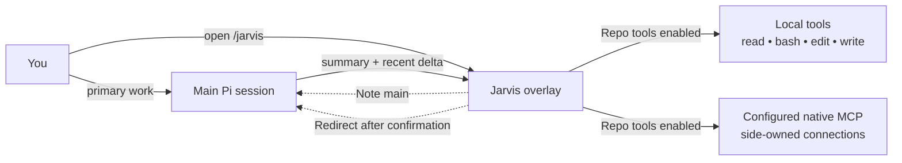
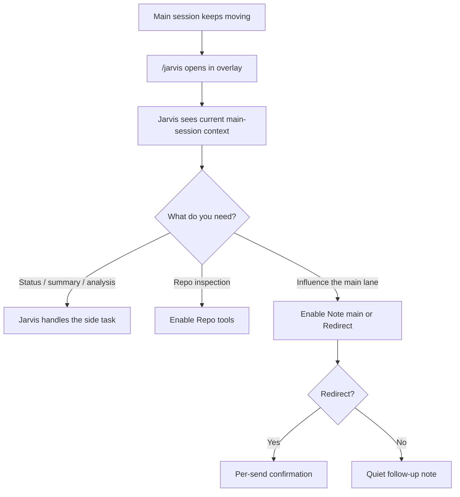
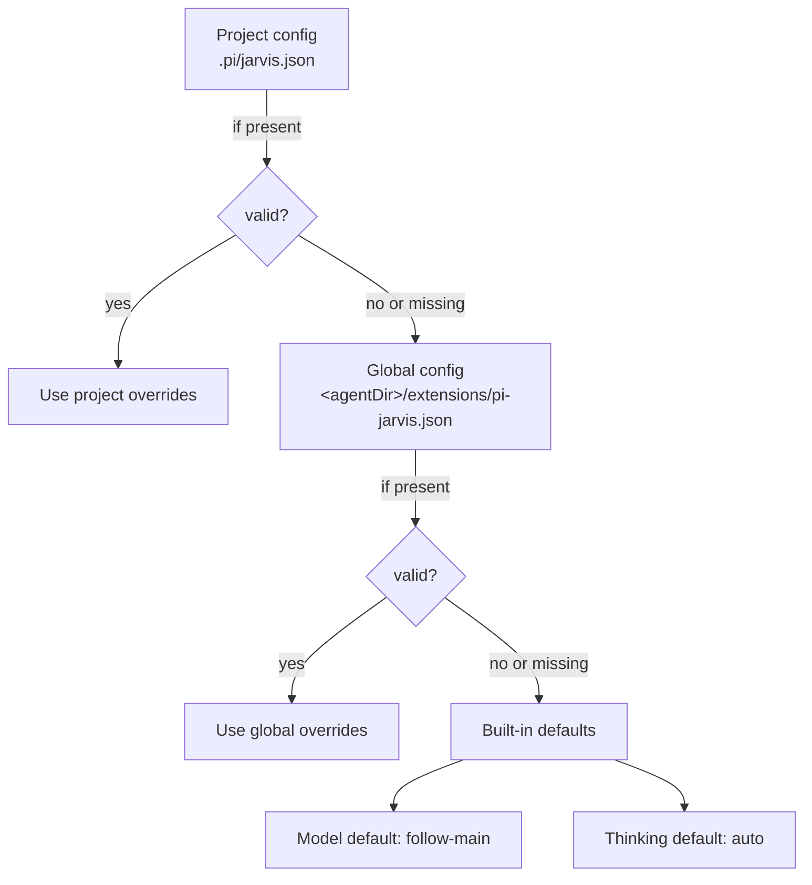
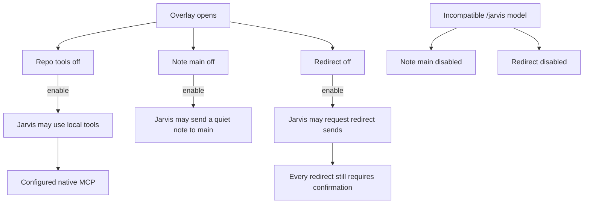
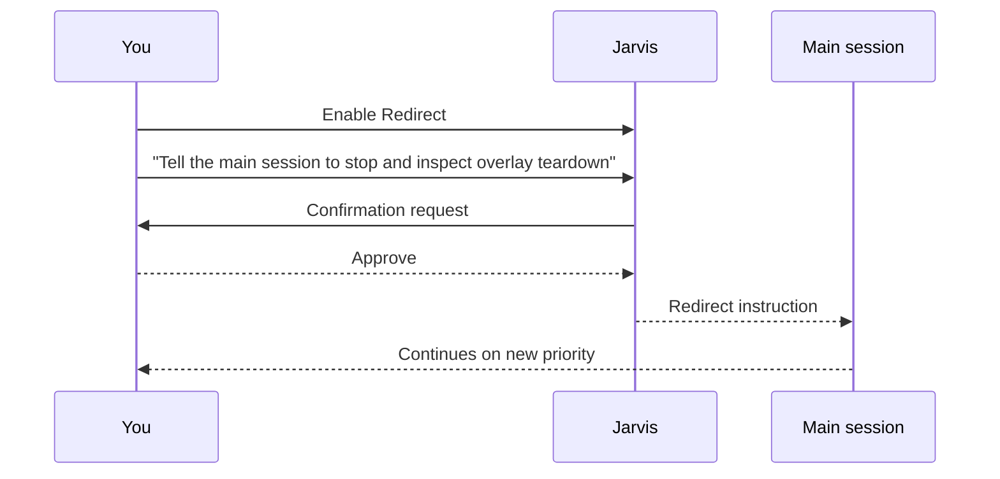

# pi-jarvis

<div align="center">


## A cinematic side-conversation overlay for Pi

**Open a second lane of thought without derailing the main session.**

`pi-jarvis` adds `/jarvis`: a polished overlay where you can ask for status, inspect the repo when you explicitly allow it, and send a quiet note or a confirmed redirect back to the main lane.

[](https://github.com/crustyhacker/pi-jarvis/actions/workflows/ci.yml)
[](https://www.npmjs.com/package/pi-jarvis)
[](./LICENSE)
[](https://github.com/crustyhacker/pi-jarvis)
[](./package.json)

<p><strong>Current version:</strong> 1.6.1</p>

<p>
  <strong>Persistent side session</strong> ·
  <strong>Live main-session awareness</strong> ·
  <strong>Opt-in local tools + native MCP</strong> ·
  <strong>Safe redirect flow</strong>
</p>

</div>

<details>
<summary>Plain-text wordmark</summary>

```text
     _    _    ____ __     _____ ____
    | |  / \  |  _ \\ \   / /_ _/ ___|
 _  | | / _ \ | |_) |\ \ / / | |\___ \
| |_| |/ ___ \|  _ <  \ V /  | | ___) |
 \___//_/   \_\_| \_\  \_/  |___|____/

       PI / A SECOND LANE OF THOUGHT
```

</details>


*Renderer preview with a custom dark palette and demo conversation—not a live provider session. Your Pi theme controls the normal overlay.*

---

## The pitch

The main Pi session should stay on the critical path.

`/jarvis` gives you a **second cockpit** for the work that should not interrupt that primary flow:

- checking what the main agent is doing right now
- seeing what changed since the last `/jarvis` turn
- asking for triage, summaries, or a second opinion
- inspecting the repo with local tools when you turn them on
- sending a non-interrupting note back to the main session
- redirecting the main session only after explicit confirmation

> Think of it as a side conversation with real context, not a detached scratchpad.

### Typical prompts

- *"What is the main agent doing right now?"*
- *"Summarize the last validation failure and tell me what matters."*
- *"Check this file while the main session keeps moving."*
- *"Compare what changed since my last `/jarvis` turn."*
- *"Redirect the main session, but make me confirm it first."*

---

## At a glance

| Capability | What you get |
|---|---|
| **Persistent side lane** | `/jarvis` keeps its own isolated conversation state and restores prior side-session history |
| **Live awareness** | Jarvis sees the current main-session summary plus a delta since the last `/jarvis` turn |
| **Permission-gated tools** | Local `read`, `bash`, `edit`, `write`, and configured native MCP stay off until you enable Repo tools |
| **Safe main-session handoff** | `Note main` is quiet; `Redirect` is confirmation-gated |
| **Independent model control** | Follow the main model or pin `/jarvis` to a separate model |
| **Cleaner UX** | A one-time neon ASCII intro, then compact diagnostics, scrollback, multiline drafts, and independent activity/queue feedback |

---

## How it fits into Pi



### Operating model



---

## Why use `/jarvis` instead of the main lane?

Use `/jarvis` when you want:

- a second opinion without changing the primary plan yet
- a quick repo inspection while the main agent keeps moving
- a compact explanation of current progress or validation state
- a controlled way to send guidance back to the main session

Stay in the main lane when you want:

- the main plan to change immediately
- the main session itself to execute the next step directly
- no side conversation overhead at all

---

## Quick start

### 1) Install

```bash
pi install npm:pi-jarvis
```

This package is meant to run **inside a Pi installation** that already provides the Pi runtime packages. Those host packages are declared as optional peers so npm does not install a second copy of the full Pi/AI provider stack just to add this extension.

Requires **Pi 1.0.0** and **Node.js 22.19.0 or newer**. Version **1.6.0** supports local repository tools and opt-in native Pi MCP as described below; it does not load the legacy `pi-mcp-adapter` or bundle another Pi runtime.

### 2) Restart or reload Pi

`pi install` registers the package automatically. For local development, build and load `./dist/index.js` with `pi -e ./dist/index.js`.
### 3) Open Jarvis

```bash
/jarvis
```

Or open it and send the first message immediately:

```bash
/jarvis summarize the last validation failure and suggest the fastest next move
```

### 4) Turn on more power only when you want it

- leave `Repo tools` off for pure context / analysis
- turn `Repo tools` on when you want local `read`, `bash`, `edit`, `write`, and configured native MCP capabilities
- turn `Note main` on when you want Jarvis to quietly message the main session
- turn `Redirect` on when you want Jarvis to propose a redirect that you still explicitly confirm

---

## Command surface

### `/jarvis`
Opens the side overlay. If text follows the command, that text becomes the first side-session prompt.

### `/jarvis-model`
In Pi's terminal UI, running `/jarvis-model` with no argument opens a searchable model picker. In RPC, JSON, and print modes it reports the current selection; exact model-setting commands still work. `/jarvis` itself requires the terminal UI and does not start hidden work in other modes.

### `/jarvis-model [--project|--global] <provider/model>`
Pins `/jarvis` to a specific model without changing the main session model. A plain `/jarvis-model <provider/model>` writes a **project-local** override to `.pi/jarvis.json`.

### `/jarvis-model [--project|--global] follow-main`
Restores the chosen scope to `follow-main`. A project-scoped `follow-main` override still wins over a global pinned setting.

### `/jarvis-model [--project|--global] clear`
Removes the selected scope so `/jarvis` falls back through the remaining config layers to the built-in default.

### `/jarvis-thinking [--project|--global] auto|follow-main|off|minimal|low|medium|high|xhigh|max`
Sets the thinking level used by `/jarvis` without changing the main session thinking level. A plain `/jarvis-thinking <level>` writes a **project-local** override to `.pi/jarvis.json`.

- `auto` preserves the built-in behavior: follow the main thinking level only when `/jarvis` follows the main model; pinned `/jarvis` models use `off`.
- `follow-main` follows the main thinking level even when `/jarvis` is pinned to a separate model.
- Explicit levels request that thinking level; Pi clamps it to the selected model's supported levels.
- Changes to main thinking immediately synchronize when `/jarvis` follows it.
- xAI `/jarvis` models still force thinking `off`.

### `/jarvis-thinking [--project|--global] clear`
Removes the selected scope so `/jarvis` thinking falls back through the remaining config layers to the built-in `auto` default.

### Side-session commands inside `/jarvis`
The `/jarvis` input handles a small set of built-in commands against the isolated side-session:

- `/compact [instructions]` compacts the `/jarvis` conversation context.
- `/tree` prints the `/jarvis` session tree with entry IDs.
- `/tree <entry-id>` navigates the `/jarvis` session tree to that entry.
- `/tree --summarize <entry-id> [instructions]` navigates and summarizes the branch being left.
- `/new` starts a fresh `/jarvis` side-session without changing the main Pi session.

---

## Model and thinking resolution



### Resolution order

Model and thinking settings resolve through the same config layers, then fall back to separate built-in defaults:

1. project config: `.pi/jarvis.json`
2. global config: `~/.pi/agent/extensions/pi-jarvis.json` or the equivalent path under a custom Pi agent dir
3. built-in defaults: model `follow-main`, thinking `auto`

Global writes do not displace an existing project override. Config writes use same-directory atomic replacement and preserve unrelated keys; unreadable files are never treated as malformed JSON and overwritten. Malformed JSON can still be explicitly cleared or replaced. Avoid simultaneous configuration writes from multiple Pi processes: cross-process locking is not implemented.

---

## Overlay controls

The overlay header exposes three controls, all **off by default**:

| Control | What it does | Safety model |
|---|---|---|
| `Repo tools` | Enables local `read`, `bash`, `edit`, and `write`, plus configured native MCP | Explicit opt-in |
| `Note main` | Sends a concise, non-interrupting note to the main session | Explicit opt-in |
| `Redirect` | Sends a redirecting instruction to the main session | Explicit opt-in + per-send confirmation |

`Note main` and `Redirect` can be forcibly disabled when the active `/jarvis` model is incompatible with bridge tools. Closing the overlay revokes all three permissions and cancels pending confirmations. Already-running local operations are not undone; newly starting calls are blocked.

Long redirects are paged: review every page with Up/Down or PageUp/PageDown before pressing Y. Resize if the terminal is too small to review safely. Configured Pi selection keybindings are respected.

### First-open neon intro

The first `/jarvis` open for each main-session ID shows the ASCII wordmark with a **1.8-second cyan/violet/pink chrome sweep**. It is decorative, not a loading screen: startup and queued prompts continue normally, and the editor and permission controls remain usable. Type or paste to dismiss it immediately; your input is preserved. Escape still closes the overlay. Confirmation review and warnings/errors take priority.

Reopening Jarvis, side `/new`, tree navigation, and returning to a previously opened main session do not replay it. The once-per-session memory lives in the loaded extension; restarting Pi or `/reload` resets it. Small terminals use a compact wordmark or skip the intro entirely. Light themes and 256-color terminals are supported; there is no flashing or terminal blinking.

To skip the intro, start Pi with `PI_JARVIS_NO_ANIMATION=1`. A non-empty `NO_COLOR` or `TERM=dumb` also suppresses it. These switches affect the intro, not Pi's other animations or colors.

### Keyboard and drafts

Version **1.5.0** adds compact diagnostics, scrollback, and a multiline draft editor.

| Key | Action |
|---|---|
| Enter | Send the draft; toggle a focused permission control |
| Shift+Enter / Ctrl+J | Insert a newline |
| Tab / Shift+Tab | Cycle between the editor and permission controls |
| Space | Toggle a focused permission control |
| PageUp / PageDown | Scroll conversation history; reaching the bottom resumes live following |
| Ctrl+End | Jump back to live output |
| Ctrl+O | Expand/collapse model, main-context delta, and access details |
| Ctrl+L | Dismiss notices |
| Escape | Close; during redirect review, cancel the confirmation instead |

The compact header keeps main status, the side model, main focus, and permissions visible. Activity and waiting-message counts remain visible while reading older output; counts exclude the active request. The latest notice appears separately; expand details for more of a long notice.

The multiline editor uses Pi's public editor and configured editing keybindings. Up/Down move within a draft; Up at the beginning of the first line (or in an empty editor) recalls prompts. Down past recalled prompts restores the draft. Pasted indentation and newlines are preserved, with Pi's normal tab-to-spaces normalization. Oversized drafts (over 64 KiB) and terminal-control payloads are rejected explicitly, never silently truncated or sent.

Unsent drafts survive closing and reopening `/jarvis` in the same running Pi session. They are not saved to disk. Side `/new`, main-session replacement, and switching to an unrelated side-session reference clear them; navigating the side tree only resets the transcript view. Closing still revokes every permission.

Scrollback follows new output until you scroll up. To bound rendering work, the overlay retains up to 500 recent entries and 512K UTF-16 code units of source text, with a 64K-unit per-entry limit. Omitted content is marked explicitly; these display limits do not modify persisted conversation history. Resizing preserves the reading position on a best-effort basis.

### Permission flow



---

## Redirect flow



---

## Session behavior

- `/jarvis` keeps its own isolated conversation state
- prior side-session history is restored from a session file under `jarvis-sessions/`
- main-tree navigation reconciles the side-session reference instead of continuing in an unrelated side thread
- reset/shutdown invalidates old queues; failed commands and uncertain sends are not automatically replayed
- side-session project resources honor the main session's project-trust decision
- Jarvis sees current main-session state plus a compact delta since the last `/jarvis` turn
- `/compact`, `/tree`, and `/new` entered inside `/jarvis` operate on the side-session, not the main session
- plain `/jarvis-model <provider/model>` writes the project model override; use `--global` to change the global default
- plain `/jarvis-thinking <level>` writes the project thinking override; use `--global` to change the global default
- thinking-step streaming is intentionally collapsed to a cleaner animated fallback for readability

---

## Example usage

### Ask for live status

```bash
/jarvis what is the main agent doing right now?
```

### Ask for triage while the main lane keeps moving

```bash
/jarvis summarize the last failing test and tell me the fastest likely fix
```

### Use Jarvis as a repo-side helper

```bash
/jarvis inspect overlay.ts for teardown or redraw risks
```

### Send a non-interrupting note back to the main session

1. Open `/jarvis`
2. Enable `Note main`
3. Ask Jarvis to send the note

### Send a redirect safely

1. Open `/jarvis`
2. Enable `Redirect`
3. Ask Jarvis to redirect the main session
4. Confirm the send

---

## Compatibility note

This repository's validation baseline is **Pi 1.0.0**, using host-provided `@earendil-works/pi-ai`, `@earendil-works/pi-coding-agent`, and `@earendil-works/pi-tui`. Older Pi versions are not supported by this release.

Physical models use the main host's public model registry for requests and credentials, including custom providers and runtime-only authentication. **Virtual/router models are not supported**: Pi's public extension registry does not expose session-aware virtual routing. Pin `/jarvis-model <provider/physical-model>` if the main session uses a virtual model.

### Native MCP

Pi already provides MCP; Jarvis 1.6.0 opts its separate SDK session into Pi's native factories when Repo tools is enabled.

- **Repo tools is the opt-in for both local tools and native MCP.** While initially off, Jarvis does not start MCP connections or expand MCP configuration credentials/commands.
- Enabling it starts **separate, side-owned connections** to configured servers from the active agent directory's `mcp.json` and, only when trusted, the project's `.pi/mcp.json`. Main-session connections are neither reused nor disconnected. Servers registered only by main-session extensions are not automatically inherited.
- Native direct, deferred/tool-search, codemode, and resource tools keep Pi's configured exposure. Jarvis rechecks live permission and session lifetime for calls, including nested calls and previously prepared tool references. Server annotations are hints, not permission grants.
- Disabling Repo tools, closing the overlay, or disposing the side runtime invalidates that permission generation, hides its tools, aborts owned call signals, and requests native disconnection. Re-enabling creates a fresh generation rather than reviving stale calls.
- **Cancellation is best effort, not rollback or a sandbox.** Pi may allow already-started connection handshakes, authentication refresh/cleanup, or remote operations to finish or time out after revocation. A pending native handshake may outlive the shutdown request until Pi finishes or times it out.
- Manage servers and OAuth sign-in in **main Pi** (`/mcp` or `pi mcp ...`), not through a side-session administration command. Jarvis does not register a side `/mcp` manager. Codemode's classifier/image-model helpers are disabled in the side session.

Use narrowly scoped credentials and trust your configured servers. Enabling Repo tools permits the configured MCP capabilities; it is not a read-only grant.

---

## Development

Install dependencies:

```bash
npm install
```

Type-check:

```bash
npm run check
```

Run tests:

```bash
npm test
```

Build the published package contents:

```bash
npm run build
```

Preview and verify the npm payload contract:

```bash
npm run verify:release
```

Check the mandatory annotated **version-number** tag policy for committed history:

```bash
npm run check:tags
```

Regenerate the shared logo and actual-renderer demo artwork after visual changes:

```bash
npm run render:branding
```

This uses deterministic fixtures, without opening a terminal, calling a provider, or connecting to MCP servers.

### Release automation

GitHub Actions validate branch pushes and pull requests on Node 22.19.0 and 24. They require an annotated **stable `vX.Y.Z` tag** on every reachable post-policy-baseline commit and run tests, build, and package verification. Every commit bumps the matching package and documentation versions; prerelease (`dev`, alpha, beta, RC), build-metadata, and SHA-only tags do not qualify. Fork PR jobs are read-only.

A matching annotated **`vX.Y.Z`** tag runs exact-tag validation and creates a GitHub release with the validated npm tarball. **npm publication stays manual**; no npm publishing token is configured. Existing assets are verified, never overwritten with different bytes.

CI reports violations; protected-branch/tag rules must be configured separately for enforcement. See [RELEASING.md](https://github.com/crustyhacker/pi-jarvis/blob/main/RELEASING.md) for atomic tagged pushes, fork/merge handling, reruns, and manual npm publication.

---

## License

`pi-jarvis` is released under the **MIT License**. See [LICENSE](./LICENSE).
